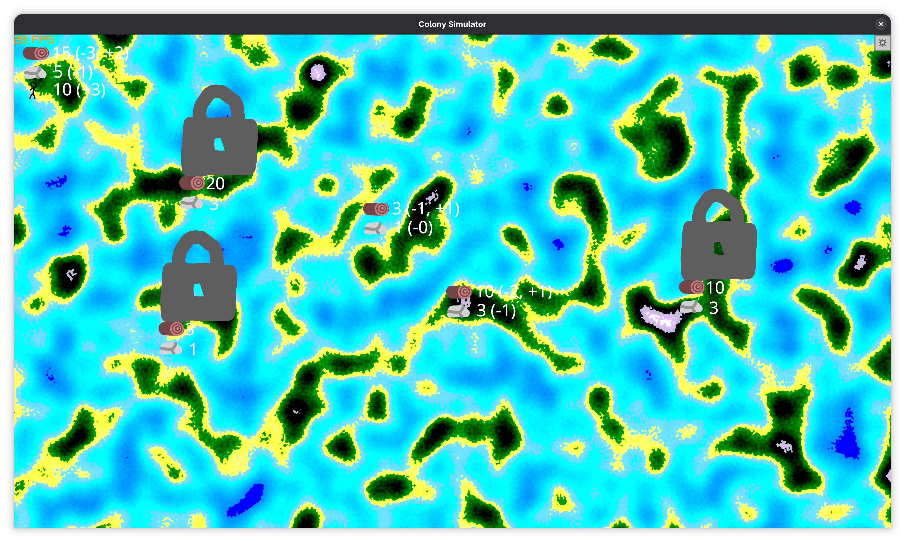

# Roadmap

## Minimum Viable Product (MVP) description

### World generation

The world is made of islands and seas generated using Perlin noise.

### Colonizing feature

Every island has a cost of colonization that is paid in in-game resources: wood and iron. If a player has enough resources to colonize the island, then it will be added to the empire after clicking on the island. The price increases, as the islands get farther away from the main island and/or get bigger in area.

### Empire growth

Every set period of time (around a second), a growth tick happens, which increases the following resources:

- People. Growth depends on the amount of people already living in the empire. The formula looks something like that: (peopleAmount * marriedPercent) / 2, where marriedPercent is set to a balanced value
- Wood. Growth is calculated by the following formula: totalAreaColonized * woodGrowthFactor, where woodGrowthFactor is a balanced value

### Island resources

Every island has the following 2 resources in random quantities depending on the island's area: wood and iron. Wood quantities can increase (trees grow), while iron is not renewable. You can extract resources from the island and add them to your capital quicker by sending more people to islands. The amount of resources depends on the island's size and increases with distance.

### Indicators

Every island that hasn't been colonized yet has a lock icon in the middle of it with wood and iron quantities specified. If an island has already been colonized, then it shows the total wood and iron left with a (+x) attached at the end of the wood indicator, where x is the number of trees that grow per growth tick.

## Features planned

### v1.0.0 (MVP)

- [x] World generation
- [x] Island extraction from the map
- [x] Colonize the island by clicking it
- [x] Empire's resources counters
- [x] Draw a lock on top of uncolonized islands
- [x] Set a price to colonize an island
- [x] Colonized islands wood growth
- [x] People on islands extract resources and add to the capital

### v1.1.0

- [x] Each island has taxes. If the taxes are too high, people stop bringing resources. If the taxes are low, the extraction efficiency increases
- [x] Population grows with time
- [x] Main menu
- [x] Progress saving/loading
- [x] More settings
- [x] Map loading progress bar
- [x] Panning with the mouse
- [x] Panning with WASD
- [x] Pause menu

### v1.2.0

- [ ] Ships flowing through the sea to the target island
- [ ] Animated people walking
- [ ] Translations

### Joke features (probably not worth implementing)

- [x] When the cursor is placed on snow (the peak of a mountain), a text appears saying "Snow (obviously)" as a reference to that one Geography lesson
